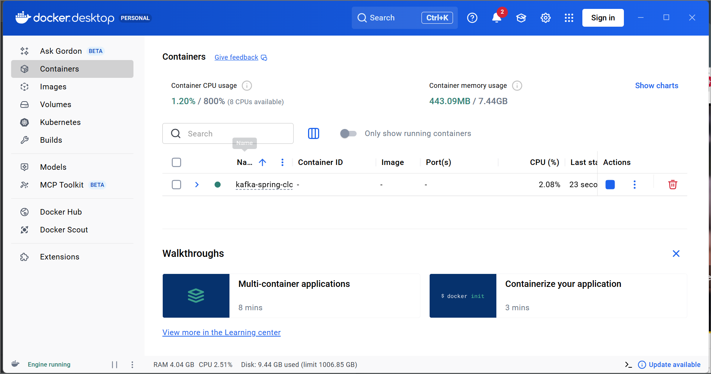
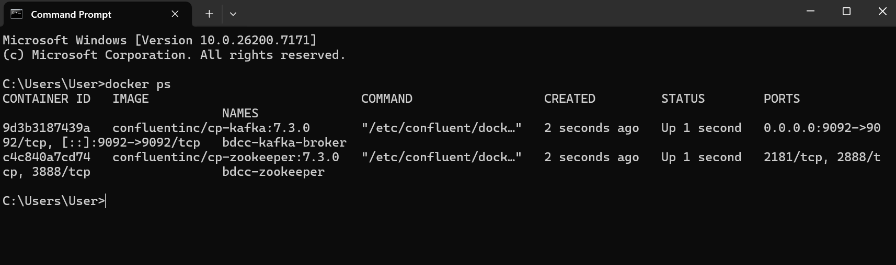
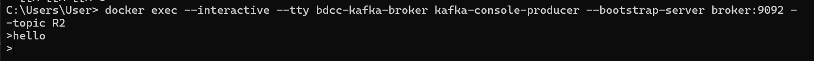
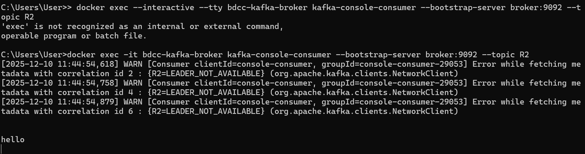
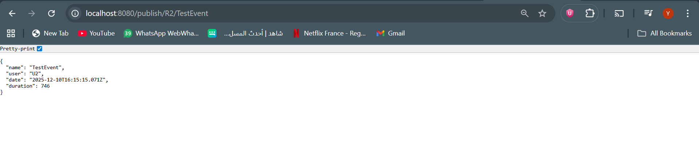
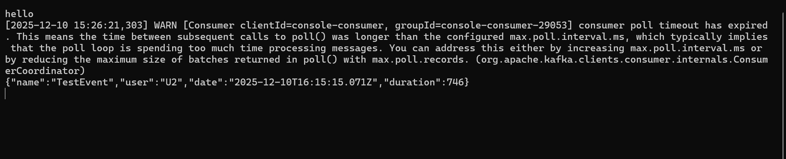
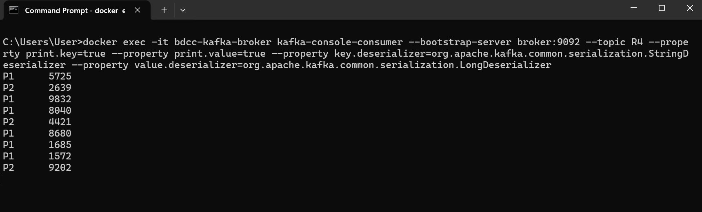
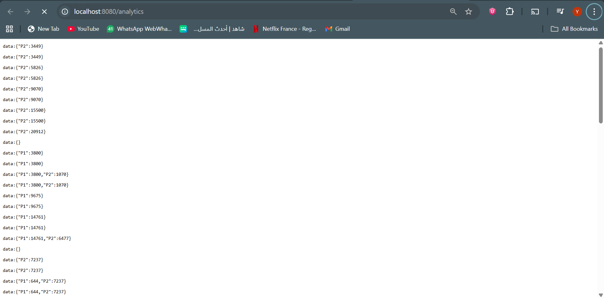
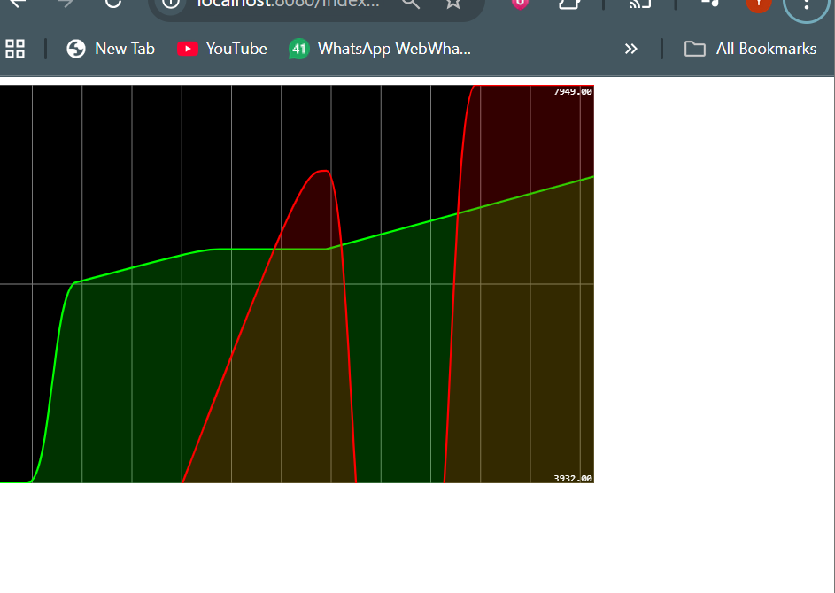

<!DOCTYPE html>
<html lang="fr">
<head>
    <meta charset="UTF-8">
    <title> Test Kafka - Producer & Consumer</title>
</head>
<body>

<h1>Partie 1 - Kafka – Producer & Consumer</h1>

Ce guide explique comment tester rapidement Kafka avec :

<ul>
    <li><strong>kafka-console-producer</strong> (producteur)</li>
    <li><strong>kafka-console-consumer</strong> (consommateur)</li>
</ul>

<h2> 1. Vérifier que Kafka tourne (Docker)</h2>

<pre>
<code>docker ps</code>
</pre>

Le conteneur Kafka (ex : <em>bdcc-kafka-broker</em>) doit apparaître.

<h2>2. Envoyer des messages (Producer)</h2>

<pre>
<code>
docker exec -it bdcc-kafka-broker kafka-console-producer \
  --broker-list broker:9092 \
  --topic R2
</code>
</pre>

Écrire ensuite :

<pre>
<code>
Hello Kafka
Message 1
Message 2
</code>
</pre>

<h2> 4. Lire les messages (Consumer)</h2>

Dans un <strong>deuxième terminal</strong> :

<pre>
<code>
docker exec -it bdcc-kafka-broker kafka-console-consumer \
  --bootstrap-server broker:9092 \
  --topic R2 \
  --from-beginning
</code>
</pre>

Vous verrez :

<pre>
<code>
Hello Kafka
Message 1
Message 2
</code>
</pre>

<h1> Partie 2 — Publication d’un Message via un REST Controller et Lecture dans Kafka</h1>

Dans cette étape, l’application Spring Boot expose une API REST permettant de publier un message directement dans un topic Kafka.
Lorsqu’un appel est effectué sur l’endpoint <code>/publish/{topic}/{name}</code>, un événement est généré puis envoyé au broker Kafka via StreamBridge.
Ensuite, l’apparition du message dans <code>kafka-console-consumer</code> confirme que la production et la consommation fonctionnent correctement.

Ajoute de cette ligne dans cmd pour avoir input et output :
docker exec -it bdcc-kafka-broker kafka-console-consumer --bootstrap-server broker:9092 --topic R4 --property print.key=true --property print.value=true --property key.deserializer=org.apache.kafka.common.serialization.StringDeserializer --property value.deserializer=org.apache.kafka.common.serialization.LongDeserializer

<h1>Partie 3 - Visualisation des nombres de visites des pages P1 et P2</h1>

Nous avons utilisé Kafka Streams pour compter en temps réel le nombre de visites des pages P1 et P2 à l’aide d’un state store nommé <b>count-store</b>. 
Ce store maintient les résultats dans une fenêtre glissante de 5 secondes, permettant de suivre l’évolution des visites en continu. 
Les données calculées sont ensuite envoyées au frontend via SSE et affichées sous forme de graphiques dynamiques.

</body>
</html>
